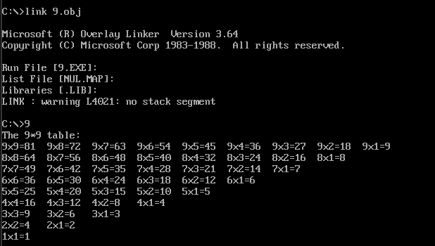
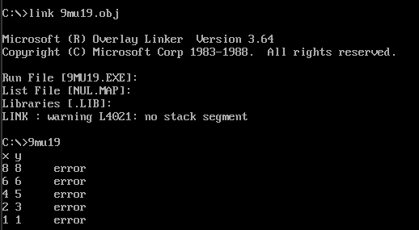

# 作业四

2250956  霍华伟

## 1.输出九九乘法表



### **源代码**：

```
DATAS SEGMENT
    CRLF   db 13,10,'$'        ; 定义回车换行符的字符串
    number dw ?,?,?,?          ; 存放乘数和被乘数，使用4字节空间
    buf    db ?,?,?,?          ; 缓存转换出来的数字，使用4字节空间
DATAS ENDS

CODES SEGMENT
           ASSUME CS:CODES,DS:DATAS
    START: 
           MOV    AX,DATAS     ; 初始化数据段
           MOV    DS,AX        ; 将数据段寄存器指向DATAS段
           
           mov    cx,9         ; 外层循环9次（乘法表到9乘9）
    s1:    
           mov    [number],cx  ; 将当前乘数（外层循环控制的值）存入number
           push   cx           ; 保存外层循环计数器的值
           push   cx           ; 乘数cx入栈，方便后续取用
          
    s2:                        ; 内层循环，计算每个乘数与当前数的乘积
           call   DisplayMultiplication ; 调用显示乘法过程

           loop   s2            ; 内层循环结束，重复乘法计算
           
           lea    dx,crlf       ; 显示换行
           mov    ah,9          ; 调用DOS中断21h功能号9
           int    21h           ; 中断调用

           pop    cx            ; 恢复外层循环计数器
           pop    cx            ; 恢复cx寄存器的乘数
       
           loop   s1            ; 继续外层循环
    
    ; 程序结束，等待用户输入一个字符后退出
           mov    ah,1          ; 调用DOS中断21h功能号1，等待键盘输入
           int    21h           ; 中断调用
    
           MOV    AH,4CH        ; 正常结束程序
           INT    21H           ; 调用DOS中断21h功能号4Ch，返回到DOS

; 显示乘法过程
DisplayMultiplication PROC
    ; 显示乘数
           mov    dx,[number]   ; 取出乘数
           add    dx,30h        ; 将乘数转换为ASCII码
           mov    ah,2          ; 调用DOS中断21h功能号2，显示字符
           int    21h           ; 中断调用

    ; 显示乘号 'x'
           mov    dl,78h        ; 'x' 的ASCII码为78h
           mov    ah,2          ; 调用DOS中断21h功能号2
           int    21h           ; 中断调用

    ; 显示第二个乘数
           mov    [number+1],cx ; 将第二个乘数保存到number+1
           push   cx            ; 第二个乘数入栈，方便后续计算使用
           mov    dx,cx         ; 将第二个乘数放到dx寄存器
           add    dx,30h        ; 转换为ASCII码
           mov    ah,2          ; 调用DOS中断21h功能号2
           int    21h           ; 中断调用

    ; 显示等号 '='
           mov    dl,3dh        ; '=' 的ASCII码为3Dh
           mov    ah,2          ; 调用DOS中断21h功能号2
           int    21h           ; 中断调用
       
    ; 计算两数相乘的结果，并显示
           pop    dx            ; 从栈中取出第二个乘数
           pop    ax            ; 从栈中取出第一个乘数
           push   ax            ; 第一个乘数再次入栈，下一次内层循环使用

           mul    dx            ; 使用乘法，将AX中的数与DX中的第二个乘数相乘，结果存在AX
           call   ConvertToDecimal ; 调用将结果转换为十进制并输出

           ret
DisplayMultiplication ENDP

; 将乘法结果转换为十进制并输出
ConvertToDecimal PROC
           mov    bx,10         ; 准备以10为基数转换成十进制
           mov    si,2          ; 准备循环2次，最大到十位 (乘法表最大乘积是81)

    toDec:                      ; 将乘积结果从AX转换为ASCII字符
           mov    dx,0          ; 清空DX，准备进行除法
           div    bx            ; 用10除AX，结果商保存在AX，余数在DX
           mov    [buf+si],dl   ; 将余数存入buf，表示某个位的数字
           dec    si            ; 指针指向更高位
           cmp    ax,0          ; 检查商是否为0
           ja     toDec         ; 若商不为0，继续循环

    output:                     ; 将转换后的数字输出
           inc    si            ; 恢复si指向的正确位置
           mov    dl,[buf+si]   ; 取出数字
           add    dl,30h        ; 转换为ASCII码
           mov    ah,2          ; 调用DOS中断21h功能号2
           int    21h           ; 中断调用
           cmp    si,2          ; 检查是否已输出所有位
           jb     output        ; 若未输出完，继续输出

    ; 输出空格
           mov    dl,20h        ; ' ' 的ASCII码为20h
           mov    ah,2          ; 调用DOS中断21h功能号2
           int    21h           ; 中断调用

           ret
ConvertToDecimal ENDP
CODES ENDS
    END START

```

### 分析：

**过程调用过程：**程序通过过程调用（Procedure Calls）实现了乘法计算和结果显示。

**程序逻辑：**使用两层循环，外层循环控制当前的乘数，内层循环遍历与之相乘的数（1 到 9），使用过程调用来封装功能，显示乘法过程和转换结果，最后通过调用 DOS 中断（`int 21h`）实现字符输出和键盘输入。


## 2.九九乘法表纠错




```
data segment
    cnt   db 80
    table db 7,2,3,4,5,6,7,8,9              ;9*9表数据
          db 2,4,7,8,10,12,14,16,18
          db 3,6,9,12,15,18,21,24,27
          db 4,8,12,16,7,24,28,32,36
          db 5,10,15,20,25,30,35,40,45
          db 6,12,18,24,30,7,42,48,54
          db 7,14,21,28,35,42,49,56,63
          db 8,16,24,32,40,48,56,7,72
          db 9,18,27,36,45,54,63,72,81
    msg   db "x y", 0ah, 0dh, '$'
    err   db 09h, "error", 0ah, 0dh, '$'
    acc   db "accomplish!", '$'
data ends
 
code segment
          assume cs:code, ds:data
    start:
          mov    cx, 9               ;行列数
          mov    ax, data            ;将数据段的地址存储在寄存器AX中
          mov    ds, ax              ;将数据段寄存器DS设置为数据段的地址，这样程序可以访问数据段中的数据
          lea    dx, msg             ;打印提示语
          mov    ah, 09h             ;将寄存器AH设置为09h，这是DOS的功能号，表示要执行字符串输出
          int    21h                 ;触发DOS中断21h，以执行字符串输出操作，输出提示语
    loop1:                           ;行循环
          push   cx                  ;乘数进栈
          mov    cx, 9               ;列数
    loop2:                           ;列循环
    ;计算两数相乘的结果，并比较
          mov    di, cx              ;取当前列数
          pop    ax                  ;取当前行数
          mov    bx, ax              ;换个寄存器
          push   ax                  ;当前行数再次进栈，在下次列循环中推出再次使用
          mul    cx                  ;行数、列数做乘法
          mov    dl, cnt             ;存偏移量
          mov    si, dx              ;8位换16位
          cmp    al, [table+si]      ;比较行、列乘积与表中数据
          je     here                ;相等跳转，不等打印
    ;打印行数
          add    bx, 30h             ;行数转化成ASCII码
          mov    dx, bx              ;放入DX寄存器
          mov    ah, 02h             ;将寄存器AH设置为2，表示要执行字符输出操作
          int    21h                 ;触发DOS中断21h，以输出空格
    ;显示空格
          mov    dl, 20h             ;将DL寄存器设置为' '，表示要输出字符空格
          mov    ah, 02h             ;将寄存器AH设置为2，表示要执行字符输出操作
          int    21h                 ;触发DOS中断21h，以输出空格
    ;打印列数
          add    di, 30h             ;列数转化成ASCII码
          mov    dx, di              ;放入DX寄存器
          mov    ah, 02h             ;将寄存器AH设置为2，表示要执行字符输出操作
          int    21h                 ;触发DOS中断21h，以输出空格
    ;打印“error”
          lea    dx, err             ;打印“error”
          mov    ah, 09h             ;将寄存器AH设置为09h，这是DOS的功能号，表示要执行字符串输出
          int    21h                 ;触发DOS中断21h，以执行字符串输出操作，输出提示语
    here: 
          dec    cnt                 ;偏移量自减，下一个数
          loop   loop2               ;列循环结束
          pop    cx                  ;还原行数
          loop   loop1               ;行循环结束

        
          mov    ah, 4ch
          int    21h
code ends
        end start
```


### 分析：

**程序逻辑：**首先将数据段的地址存入 `AX` 寄存器，然后设置数据段寄存器 `DS`，使得程序可以访问数据段中的数据，外层循环控制行数，每次循环推送 `cx` 寄存器到栈中以备后续使用，并将 `cx` 设置为 9，表示列数，内层循环开始，`di` 用于存储当前列数，`ax` 用于存储当前行数，并再次推送 `ax` 以备后续使用，`mul` 指令执行行数和列数的乘法，结果存放在 `AX` 寄存器中，将乘积与乘法表中的对应值进行比较。如果相等，则跳过后续的错误输出。如果乘积不匹配，则输出当前的行数和列数，以及错误信息。

## 实验心得

在编写乘法表比较的程序时，我学习到了如何使用嵌套循环来处理二维数组的逻辑。在内外层循环的设计中，我需要合理管理寄存器和栈空间，这让我体会到了精确控制的重要性。此外，条件判断与分支的运用增强了我对程序逻辑的理解，通过此次实验，我对汇编语言的应用前景有了更深刻的理解。