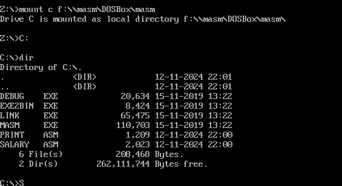
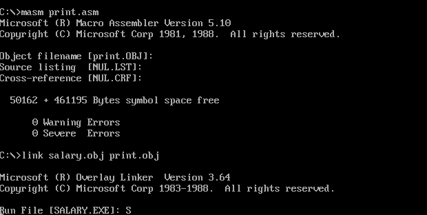
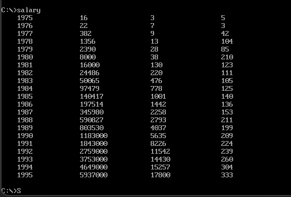

# 作业五

该作业分为salary.asm和print.asm模块，分模块编程的结构将代码分成了主模块和打印模块，每个模块负责不同的功能。

## salary.asm

**功能**：主模块主要负责程序的主逻辑，包括数据的加载、计算和调用打印子程序来输出格式化的数据。

**作用**：

- 读取年份、收入、雇员数量的数据。
- 计算人均收入（收入总数除以雇员数）。
- 调用打印模块中的 `Print`子程序来输出数据。
- 使用循环结构来遍历每一年的数据，并按预设的格式依次输出 **年份、收入、雇员、人均收入**，行尾进行换行。

**分工**：主模块承担了程序的控制逻辑和数据处理功能，但不包含具体的打印实现逻辑，而是通过调用外部的 `Print` 子程序来完成打印。

## print.asm

**功能**：打印模块仅负责将寄存器 `AX` 中的数字转换为字符串，并逐字符输出到屏幕。

**作用**：

- 将输入的整数（通过 `AX` 寄存器传递）逐位分解，并转换为对应的 ASCII 字符。
- 使用 DOS 中断将字符输出到屏幕。

**分工**：打印模块负责将数值格式化为可读的字符串并打印到屏幕上。这一功能被设计为一个独立的子程序 `PrintNumber`，主模块可以随时调用它来完成打印任务。

### 其结果如下：

## 总结

- 主模块管理主逻辑和数据流程，聚焦于业务逻辑。
- 打印模块负责数值格式化输出，提供专门的打印服务。

链接器将模块整合，使得主模块与打印模块顺利通信，形成一个完整、可执行的程序。
